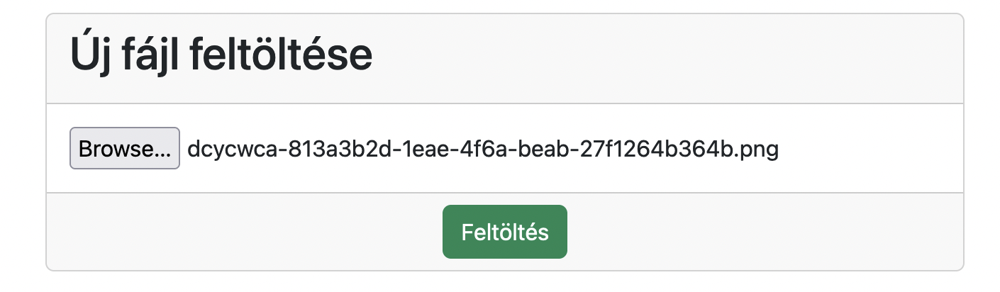
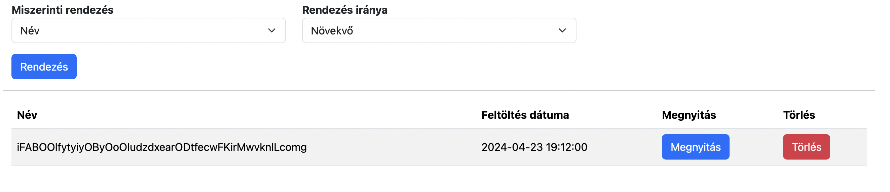
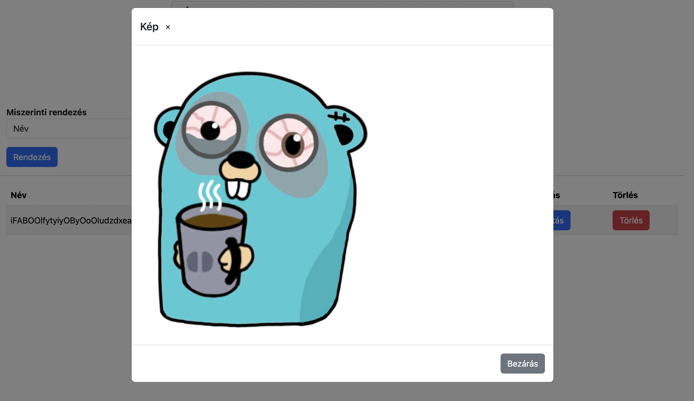

# Felhőalapú eloszott rendszerek laboratórium házifeladat - fényképalbum

## Architektúra

A rendszert két fő komponensre lehet felbontani. A megvalósított architektúra követi a napjainkban igén népszerű – és felhő környezetben gyakran használt – `kliens-szerver` felépítést.

### Szerver oldali szolgáltatás

A `backend` felelős a feltölteni kívánt képek feltöltéséért, tárolásáért, lekérdezéséért – rendezve, nem rendezve – illetve törléséért is. 

A szolgáltatás a `Go` nyelvben lett megírva, amely egy statikusan típusos nyelv és a könnyen használható konkurrens programozási modellje miatt gyakran választják skálázható rendszerek esetén.

A `backend`-en megvalósítandó funkciókért az alábbi rétegek felelősek:
- transport: bejövő `HTTP` kérések feldolgozása,
- repository: adatbázis műveletek.

A szolgáltatás egyfelől biztosít egy publikus `REST API` interfészt ahol az egyes funkciók elérhetőek.

|Metódus|URL|Funckió|
|:--|:--|:--|
|GET|/api/images|Felvett képek listájának lekérdezése, illetve rendezés. |
|POST|/api/images|Új kép feltöltése.|
|DELETE|/api/images/{name}|Adott névvel rendelkező kép törlése.|

Ezen a szolgáltatás biztosít egy olyan végpontot is, amely a feltöltött képek megjelenítésére ad lehetőséget, ami az alábbi: `GET /static/{fileName}`.

A szolgáltatás kapcsolatot tart fenn egy `MariaDB` adatbázissal, ahova menti, hogy milyen képek mikor lettek feltöltve. Minden egyes feltöltés esetén a rendszer generál egy 40 karakterből álló teljesen véletlenszerű karakterláncot – amely a tárolandó kép neve is egyben –, amely szerint lekérdezhető az adott egyed.

Lehetőség nyílik a tárolt képek név illetve feltöltési dátum szerinti lekérdezésére is.

### Kliens oldali szolgálatás

A felhasználó a rendszert böngészőn keresztül érheti el. Ennek a portálnak a fejlesztése `Svelte` keretrendszerben történt, amihez a `TypeScript` nyelvet használtam.

A felhasznált keretrendszer miatt az oldal a kliens böngészőjében fog renderlődni és mindig aszinkron hívásokat intéz a szerveroldali szolgáltatás irányába.

## Működés

Az alábbi képen látható form szolgál az új képek feltöltésére, ahol a `Browse` gomb megnyomásával válaszhatjuk ki az általunk feltöleni kívánt képet. Kiválasztás után a `Feltöltés` gomb megnyomásával egy aszinkron kérést küldünk a szervernek, amely megpróbálja feltölteni a képet.

Sikeres feltöltés után form alatt található táblázatban megjelenik egy új sor, amely az imént feltöltött kép adatait tartalmazza.

Az egyes sorokban láthatjuk, hogy milyen névvel érhetőek el a szerveren, illetve, hogy mikor lett az adott kép feltöltve. A sorban helyett kapott két gomb is. A `Megnyitás` feliratú letölti megjeleníti a tárolt képet a szerverről kiszolgálva, míg a `Törlés` feliratú gomb megnyomásával véglegesen töröljük az adott képet.

Ezeke mellett a fenti két `select` mező segítségével tudunk rendezést végrehajtani.

`Megnyitás` gomb esetén az alábbi nézet töltődik be:

